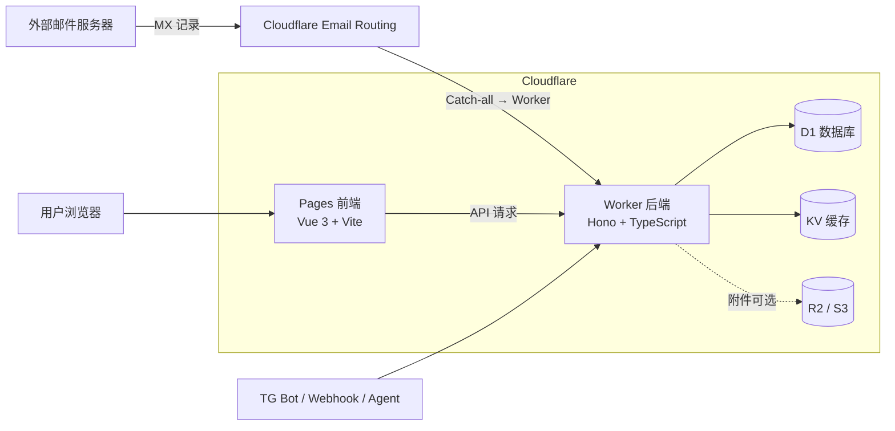

<!-- markdownlint-disable-file MD033 MD045 -->

# Skycloak — 基于 Cloudflare 全家桶的临时邮箱服务

<p align="center">
  <a href="README.md">中文</a> |
  <a href="README_EN.md">English</a> |
  <a href="CHANGELOG.md">更新日志</a>
</p>

> 本项目 fork 自 [dreamhunter2333/cloudflare_temp_email](https://github.com/dreamhunter2333/cloudflare_temp_email)（v1.9.0），在原项目基础上整理与维护，版权归上游作者所有，在此致谢。仅供学习和个人用途，请勿用于任何违法行为，后果自负。

**一个功能完整的临时邮箱服务，完全跑在 Cloudflare 免费套餐上：**

- **零成本** — 基于 Workers / Pages / D1 / KV / Email Routing 免费额度构建，无需自有服务器
- **高性能解析** — 邮件由 Rust WASM（`mail-parser-wasm`）解析，几乎能解析所有邮件格式
- **现代化界面** — Vue 3 响应式设计，前后台均支持多语言
- **地址密码** — 可为邮箱地址设置独立密码，也可作为私人站点启用访问密码
- **Agent 友好** — 内置 [`cf-temp-mail-agent-mail`](skills/cf-temp-mail-agent-mail/SKILL.md) skill，AI agent 可直接收信取验证码
- **移动端管理** — 社区客户端 [CloudMail](https://github.com/Lur1N77777/CloudMail)（Android 管理后台 + 邮箱管理）

## 目录

- [架构](#架构)
- [功能列表](#功能列表)
- [部署指南](#部署指南)
  - [前置条件](#前置条件)
  - [方式一：命令行部署（推荐）](#方式一命令行部署推荐)
  - [方式二：其他部署方式](#方式二其他部署方式)
  - [升级](#升级)
- [发送邮件与 SMTP 代理](#发送邮件与-smtp-代理)
- [常见提醒](#常见提醒)
- [致谢](#致谢)
- [License](#license)

## 架构

收件链路完全依赖 **Cloudflare Email Routing**：外部邮件进入你的域名后，由 Cloudflare 的 Catch-all 规则投递给 Worker，Worker 解析后写入 D1，前端从 Worker API 读取。



| 组件 | 目录 | 技术 |
| --- | --- | --- |
| 后端 Worker | [`worker/`](worker/) | TypeScript + Hono，Cloudflare Workers |
| 前端 | [`frontend/`](frontend/) | Vue 3 + Vite + TypeScript |
| 邮件解析 | [`mail-parser-wasm/`](mail-parser-wasm/) | Rust → WebAssembly |
| SMTP/IMAP 代理 | [`smtp_proxy_server/`](smtp_proxy_server/) | Python（aiosmtpd + Twisted） |
| Pages Functions | [`pages/`](pages/) | Cloudflare Pages 中间件（请求转发） |
| 数据库脚本 | [`db/`](db/) | D1 schema 与各版本 patch SQL |
| 文档站 | [`vitepress-docs/`](vitepress-docs/) | VitePress |

## 功能列表

### 邮件处理

- Rust WASM 解析邮件，速度快、兼容性好（node 解析失败的邮件也能解析）
- **AI 邮件识别**：用 Cloudflare Workers AI 自动提取验证码、认证链接、服务链接
- 支持随机二级域名地址，适合收件隔离场景
- 支持发送邮件，支持 DKIM 验证，支持 SMTP / Resend 等多种发送方式
- 附件查看与图片显示，支持 S3 / R2 附件存储与删除
- 垃圾邮件检测、黑白名单、邮件转发（含全局转发地址）

### 用户管理

- 凭证（JWT）重新登录之前的邮箱
- 完整的注册登录，可绑定邮箱地址并自动切换凭证
- OAuth2 第三方登录（GitHub、Authentik 等）与 Passkey 无密码登录
- 用户角色管理，支持多角色域名和前缀配置
- 收件箱过滤（地址、关键词）

### 管理功能

- 完整的 admin 控制台：创建无前缀邮箱、用户地址查看
- 定时清理邮件，多种清理策略
- 自定义前缀邮箱、admin 黑名单、站点访问密码

### 集成与扩展

- 完整的 Telegram Bot 支持（推送 + Bot 小程序）、Webhook 消息推送
- SMTP proxy server：支持标准 SMTP 发信、IMAP 收信
- Cloudflare Turnstile 人机验证、新建地址限流
- 内置 Agent skill：[`cf-temp-mail-agent-mail`](skills/cf-temp-mail-agent-mail/SKILL.md)，详见 [Agent 收信文档](vitepress-docs/docs/zh/guide/feature/agent-email.md)
- 前台后台多语言、响应式 UI、Google Ads 集成、URL JWT 参数自动登录

更多功能细节见 [`vitepress-docs/docs/zh/guide/feature/`](vitepress-docs/docs/zh/guide/feature/)。

## 部署指南

完整文档在 [`vitepress-docs/`](vitepress-docs/)（CLI / UI / GitHub Actions 三种方式均有逐步说明）。下面摘录最常见的 CLI 部署路径。

### 前置条件

1. **一个域名**（一级域名或子域名均可），DNS 托管到 Cloudflare。
2. 在 Cloudflare 控制台为该域名启用 **Email Routing**，并完成“电子邮件 DNS 记录”下发；部署前需至少一个已验证的目标地址。
3. 准备 Cloudflare 账号，安装 wrangler：

```bash
npm install wrangler -g
git clone https://github.com/Dyrk2020/Skycloak.git
```

> 子域名收信时，必须对该子域单独启用 Email Routing 并配置 Catch-all——子域名不会继承父域的 Email Routing 配置。若要使用随机子域名功能，还需在基础域名 DNS 为 `*` 子域添加通配 MX 记录。

### 方式一：命令行部署（推荐）

#### 1. 初始化 D1 数据库

```bash
cd worker
pnpm install
cp wrangler.toml.template wrangler.toml

wrangler d1 create temp-email-db
wrangler d1 execute temp-email-db --file=../db/schema.sql --remote
```

#### 2. 配置并部署 Worker

编辑 `worker/wrangler.toml`：

```toml
name = "cloudflare_temp_email"
main = "src/worker.ts"
compatibility_date = "2024-09-23"
compatibility_flags = [ "nodejs_compat" ]

[vars]
PREFIX = "tmp"                      # 邮箱名称前缀
DOMAINS = ["xxx.xxx1", "xxx.xxx2"]  # 临时邮箱使用的域名，支持多个
JWT_SECRET = "xxx"                  # JWT 签名密钥，建议 openssl rand -hex 32 生成
ENABLE_USER_CREATE_EMAIL = true
ENABLE_USER_DELETE_EMAIL = true
# ADMIN_PASSWORDS = ["123", "456"]  # 配置后可访问 admin 控制台

[[d1_databases]]
binding = "DB"
database_name = "temp-email-db"
database_id = "xxx"                 # 第 1 步创建的 D1 ID
```

常用可选项（均在 `wrangler.toml` 模板中有注释说明）：`[[kv_namespaces]]`（用户注册验证码 / Telegram Bot 需要）、`[assets]`（把前端打包进 Worker 单体部署）、`[triggers]`（定时清理）、`send_email`（Cloudflare 发信）、`[[unsafe.bindings]]`（限流）。全部变量见 [worker 变量说明](vitepress-docs/docs/zh/guide/worker-vars.md)。

部署：

```bash
pnpm run deploy
```

访问 Worker URL 显示 `OK`，`/health_check` 也显示 `OK` 即部署成功。

#### 3. 配置 Email Routing Catch-all

在 Cloudflare 控制台对应域名的 `Email Routing` → `路由规则` 中，把 **Catch-all 地址** 的动作设为“发送到 Worker”，目标选择上一步的 Worker。未完成此步将收不到任何邮件。

#### 4. 部署前端

前后端分离部署（推荐，也可用第 2 步的 `[assets]` 单体部署）：

```bash
cd frontend
pnpm install
cp .env.example .env.prod
# 编辑 .env.prod：VITE_API_BASE=https://<你的-worker-url>，末尾不要加 /
pnpm build --emptyOutDir
pnpm run deploy   # 首次部署会提示创建项目，production 分支填 production
```

也可以通过 `pages/` 的 Pages Functions 转发后端请求获得更快响应（见 [Pages 部署文档](vitepress-docs/docs/zh/guide/cli/pages.md)）。注意本项目是 SPA：通过控制台手动上传时，“未找到处理”必须选 `Single-page application (SPA)`，否则刷新或访问 `/admin` 会 404。

### 方式二：其他部署方式

- 用户界面（控制台）部署：[`vitepress-docs/docs/zh/guide/ui/`](vitepress-docs/docs/zh/guide/ui/)
- GitHub Actions 自动部署：[`vitepress-docs/docs/zh/guide/actions/`](vitepress-docs/docs/zh/guide/actions/)

### 升级

升级是**用新版本产物覆盖部署**，而不是修改控制台里运行的旧代码：

1. 对照 [CHANGELOG](CHANGELOG.md) 确认当前版本之后的变更，`Breaking Changes` 通常需要执行数据库 SQL 或修改变量。
2. 有数据库变更时，在 admin 后台 `快速设置 → 数据库` 执行升级，或用 `wrangler d1 execute --file=../db/<日期>-patch.sql --remote` 手动执行对应 patch（patch 文件都在 [`db/`](db/) 下）。
3. 按原部署方式重新覆盖 Worker 和 Pages；GitHub Actions 用户先同步 fork 再重跑 workflow。

## 发送邮件与 SMTP 代理

- Worker 侧发信支持 Cloudflare Email Routing（`send_email`）与 Resend，配置见 [发送邮件文档](vitepress-docs/docs/zh/guide/config-send-mail.md)。
- [`smtp_proxy_server/`](smtp_proxy_server/) 提供标准 SMTP（默认端口 8025）与 IMAP（默认端口 11143）代理，让任意邮件客户端 / 程序直接收发本服务的邮件，支持 Docker 部署（`docker-compose.yaml`），配置见 [SMTP 代理文档](vitepress-docs/docs/zh/guide/feature/config-smtp-proxy.md)。

## 常见提醒

- `*.workers.dev` 域名在国内无法访问，请为 Worker 配置自定义域名（`routes`）。
- 在 Resend 添加域名记录时，如果你的域名解析服务商正在托管三级域名 `a.b.com`，请删除 Resend 生成的默认 name 中的二级域名前缀 `b`，否则会添加成 `a.b.b.com` 导致验证失败。添加后可用 `nslookup -qt="mx" a.b.com 1.1.1.1` 验证。
- 其他常见问题见 [common-issues](vitepress-docs/docs/zh/guide/common-issues.md)。

## 致谢

- 上游项目：[dreamhunter2333/cloudflare_temp_email](https://github.com/dreamhunter2333/cloudflare_temp_email) —— 本仓库是其 fork，所有核心设计与实现均来自上游及其贡献者。
- 社区移动端客户端：[CloudMail](https://github.com/Lur1N77777/CloudMail)。
- 上游项目曾收录于 [HelloGitHub](https://hellogithub.com/)。

## License

[MIT](LICENSE) © 上游原作者 Dream Hunter 及本仓库贡献者。